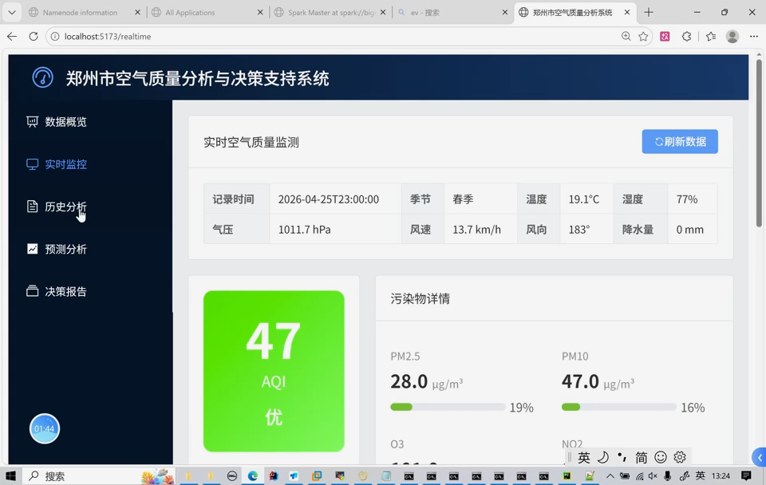
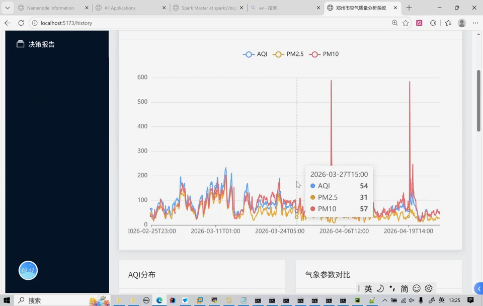
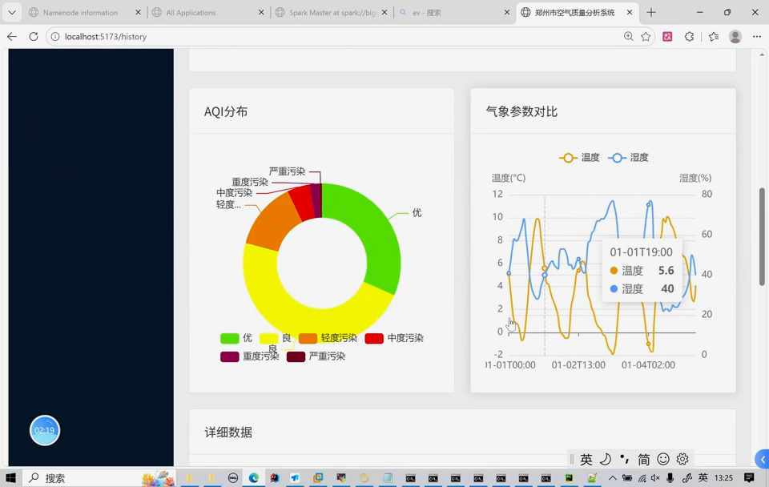
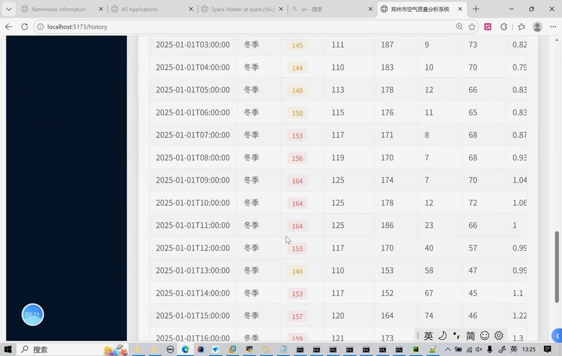
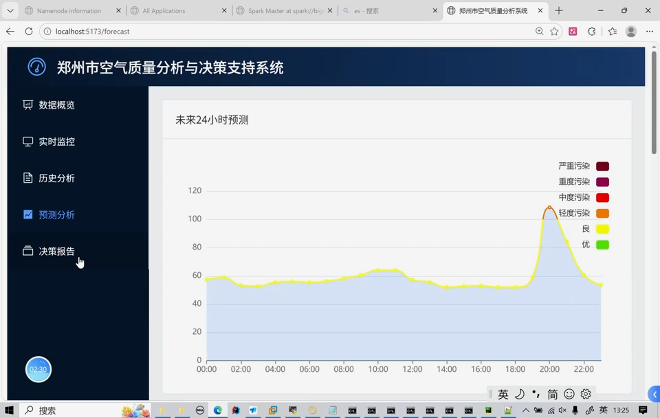
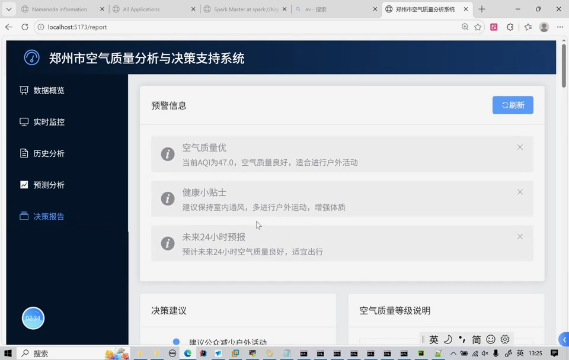

## 计算机毕业设计吊炸天Python+AI大模型空气质量预测分析 空气质量可视化 空气质量爬虫 机器学习 深度学习 大 数据毕业设计 机器学习 深度学习 知识图谱 大数据 大数据毕设 深度学习 机器学习 大数据 大数据毕业设计 机器学习 预测系统 数据仓库 大数据毕业设计 文本分类 LSTM情感分析 大数据毕业设计 知识图谱 大数据毕业设计 预测系统 实时计算 离线计算 数据仓库 人工智能 神经网络

## 要求
### 源码有偿！一套(论文 PPT 源码+sql脚本+教程)

### 
### 加好友前帮忙start一下，并备注github有偿hive物流数仓+预测
### 我的QQ号是2827724252或者微信:bysj2023nb

# 

### 加qq好友说明（被部分 网友整得心力交瘁）：
    1.加好友务必按照格式备注
    2.避免浪费各自的时间！
    3.当“客服”不容易，repo 主是体面人，不爆粗，性格好，文明人。

演示视频如下：

https://www.bilibili.com/video/BV17KLm6BE2g/

## 演示视频

https://www.bilibili.com/video/BV17KLm6BE2g/

